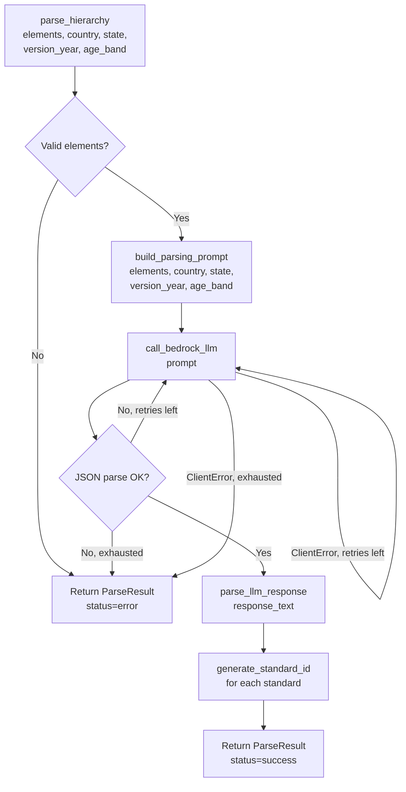

# Design Document: AI-Powered Parser

## Overview

Replace the rule-based hierarchy parser in `src/els_pipeline/parser.py` with an LLM-powered implementation that calls Amazon Bedrock (Claude) to resolve parent-child relationships between `DetectedElement` objects and produce `NormalizedStandard` objects. The new parser eliminates all prefix-matching and document-order heuristics, delegating the structural reasoning entirely to the LLM — the same approach already proven in `detector.py`.

The root cause of the Texas failure is that Texas uses Roman numeral domain codes (`I`, `II`, ...) with letter-based strand codes (`I.A`, `I.B`, ...) and age-prefixed indicator codes (`PK3.I.A.1`, `PK4.I.A.2`). Neither the prefix-matching strategy (which expects child codes to start with parent codes) nor the document-order strategy (which relies on consistent nesting order) can handle this structure. An LLM can reason about the full context and resolve the hierarchy correctly regardless of coding scheme.

## Architecture



## Components and Interfaces

### `parse_hierarchy(elements, country, state, version_year, age_band="PK") -> ParseResult`

Public entry point. Filters out `needs_review=True` elements, validates the remaining list is non-empty, then delegates to the LLM pipeline.

### `build_parsing_prompt(elements, country, state, version_year, age_band) -> str`

Serializes the list of `DetectedElement` objects into a structured prompt. The prompt instructs the LLM to:

- Assign each indicator to its correct domain, strand, and sub_strand based on the document's structural context.
- Include the description text for each domain, strand, and sub_strand level (taken from the corresponding `DetectedElement.description` field); use `null` if no description exists.
- Detect an age band from each indicator's description or source text; fall back to the provided `age_band` parameter if none is found.
- Return a JSON array of objects with fields: `domain_code`, `domain_name`, `domain_description`, `strand_code`, `strand_name`, `strand_description`, `sub_strand_code`, `sub_strand_name`, `sub_strand_description`, `indicator_code`, `indicator_name`, `indicator_description`, `age_band`, `source_page`, `source_text`.

### `call_bedrock_llm(prompt, max_retries=MAX_BEDROCK_RETRIES) -> str`

Identical pattern to `detector.py`. Creates a `bedrock-runtime` boto3 client using `Config.AWS_REGION` and invokes `Config.BEDROCK_LLM_MODEL_ID`. Retries on `ClientError` up to `max_retries` times.

### `parse_llm_response(response_text, country, state, version_year) -> List[NormalizedStandard]`

Extracts the JSON array from the LLM response (stripping markdown fences if present), validates each object, and constructs `NormalizedStandard` instances. Maps `domain_description`, `strand_description`, and `sub_strand_description` from the LLM output onto the `description` field of the corresponding `HierarchyLevel` objects. Calls `generate_standard_id()` to populate `standard_id`.

### `generate_standard_id(country, state, version_year, domain_code, indicator_code) -> str`

Unchanged from the current implementation. Returns `f"{country}-{state}-{version_year}-{domain_code}-{indicator_code}"`.

## Data Models

### Prompt Input Shape

Each `DetectedElement` is serialized as:

```json
{
  "level": "domain|strand|sub_strand|indicator",
  "code": "I.A",
  "title": "Self-Awareness",
  "description": "...",
  "source_page": 5,
  "source_text": "PK4.I.A.2 Child shows self-awareness..."
}
```

`needs_review=True` elements are excluded before serialization.

### LLM Output Shape (per indicator)

The LLM is asked to return one object per indicator (leaf-level element). Descriptions for domain, strand, and sub_strand are included so that the full context of each level is preserved in the output:

```json
{
  "domain_code": "I",
  "domain_name": "Social and Emotional Development",
  "domain_description": "Encompasses children's ability to understand and manage emotions, build relationships, and develop a sense of self.",
  "strand_code": "I.A",
  "strand_name": "Self-Awareness",
  "strand_description": "Children develop an understanding of their own identity, emotions, and physical characteristics.",
  "sub_strand_code": null,
  "sub_strand_name": null,
  "sub_strand_description": null,
  "indicator_code": "PK4.I.A.2",
  "indicator_name": "Child shows self-awareness of physical characteristics",
  "indicator_description": "Child can identify and describe their own physical features such as hair color, eye color, and body parts.",
  "age_band": "PK4",
  "source_page": 5,
  "source_text": "PK4.I.A.2 Child shows self-awareness..."
}
```

- `domain_description`, `strand_description`, and `sub_strand_description` are populated from the document text associated with each level. If no description text exists in the document for a level, the LLM returns `null`.
- `age_band` is populated by the LLM if detectable from the indicator text; otherwise the LLM returns `null` and the fallback `age_band` parameter is used.

### `NormalizedStandard` (existing model, `age_band` field added)

The existing `NormalizedStandard` model in `models.py` needs one new optional field:

```python
age_band: Optional[str] = None
```

All other fields remain unchanged.

## Correctness Properties

_A property is a characteristic or behavior that should hold true across all valid executions of a system — essentially, a formal statement about what the system should do. Properties serve as the bridge between human-readable specifications and machine-verifiable correctness guarantees._

Property 1: parse*hierarchy always returns a ParseResult
\_For any* input (valid elements, empty list, all-review-flagged elements, or elements that cause an LLM error), `parse_hierarchy()` should always return a `ParseResult` object — never raise an exception.
**Validates: Requirements 3.4, 5.3**

Property 2: age*band fallback
\_For any* call to `parse_hierarchy()` with a given `age_band` parameter, if the LLM returns `null` for an indicator's age_band, the resulting `NormalizedStandard` should carry the parameter value as its `age_band`.
**Validates: Requirements 2.2**

Property 3: age*band passthrough
\_For any* `age_band` string (including `"PK"`, `"PK3"`, `"PK4"`, `"36 months"`, `"48 months"`, and arbitrary strings), `parse_hierarchy()` should accept it without raising an exception.
**Validates: Requirements 2.3, 3.2**

Property 4: generate*standard_id determinism and format
\_For any* valid combination of `country`, `state`, `version_year`, `domain_code`, and `indicator_code`, calling `generate_standard_id()` twice with the same arguments should return the same string, and that string should match the pattern `{country}-{state}-{version_year}-{domain_code}-{indicator_code}`.
**Validates: Requirements 4.2, 4.3**

Property 5: JSON parse retry exhaustion returns error
_For any_ call to `parse_hierarchy()` where the mocked Bedrock always returns invalid JSON, the result should have `status="error"` and Bedrock should have been called exactly `MAX_PARSE_RETRIES + 1` times.
**Validates: Requirements 1.3, 1.5, 5.1**

Property 6: ClientError retry exhaustion returns error
_For any_ call to `parse_hierarchy()` where the mocked Bedrock always raises `ClientError`, the result should have `status="error"` and Bedrock should have been called exactly `MAX_BEDROCK_RETRIES + 1` times.
**Validates: Requirements 1.4, 1.5, 5.2**

## Error Handling

| Condition                                  | Behavior                                                                              |
| ------------------------------------------ | ------------------------------------------------------------------------------------- |
| Empty `elements` list                      | Return `ParseResult(status="error")` immediately, no Bedrock call                     |
| All elements have `needs_review=True`      | Return `ParseResult(status="error")` immediately, no Bedrock call                     |
| LLM returns invalid JSON                   | Retry up to `MAX_PARSE_RETRIES`; on exhaustion return `ParseResult(status="error")`   |
| Bedrock raises `ClientError`               | Retry up to `MAX_BEDROCK_RETRIES`; on exhaustion return `ParseResult(status="error")` |
| Unexpected exception                       | Catch, log, return `ParseResult(status="error", error=str(e))`                        |
| LLM returns object missing required fields | Skip that indicator, log a warning, continue                                          |

## Testing Strategy

**Dual approach**: unit tests for specific examples and edge cases; property-based tests (Hypothesis, already in `pyproject.toml`) for universal properties.

**Unit tests** (in `tests/integration/test_parser_integration.py` or a new `tests/unit/test_parser.py`):

- Bedrock is called with the correct model ID (mock boto3)
- JSON parse retry: mock returns invalid JSON N times, verify call count and error status
- ClientError retry: mock raises ClientError N times, verify call count and error status
- Empty input returns error without calling Bedrock
- All-review input returns error without calling Bedrock
- `generate_standard_id` format example: `"US-CA-2021-LLD-LLD.1"`
- Old rule-based function names are not exported from the module

**Property-based tests** (Hypothesis, minimum 100 examples each):

- Tag format: `Feature: ai-powered-parser, Property {N}: {property_text}`
- Property 1: always returns ParseResult — generate arbitrary element lists
- Property 2: age_band fallback — generate arbitrary age_band strings, mock LLM returning null age_band
- Property 3: age_band passthrough — generate arbitrary age_band strings, verify no exception
- Property 4: generate_standard_id determinism and format — generate arbitrary (country, state, year, domain, indicator) tuples
- Properties 5 & 6: retry exhaustion — covered by unit tests (deterministic mock behavior, not random inputs)
